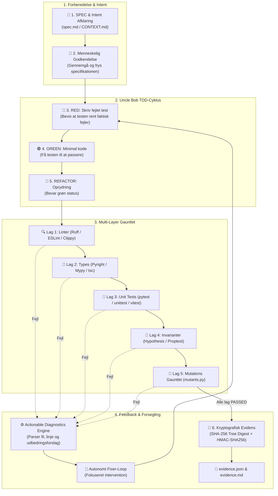

# agent-gauntlet 🛡️

**agent-gauntlet** er en universel multi-stack verifikations- og actionable diagnostics motor bygget på **Uncle Bobs (Robert C. Martin) TDD- og Clean Craftsmanship-filosofi**.

Den omgiver AI-genereret kode med et kompromisløst verifikations-gauntlet (Linters, Type-checkere, Unit tests, Property- og Invariant-tests, Mutationsafprøvning og HMAC-signerede evidensregistre) og oversætter rå fejludskrifter til **Actionable Diagnostics**, som AI-agenter kan handle direkte på.

---

## 🎯 Arkitektur & Designprincipper

1. **Uncle Bob Clean Architecture & TDD:**
   * Forankret i de 3 Love for TDD, Transformation Priority Premise (TPP) og Single Responsibility Principle (SRP).
2. **Package-by-Feature Struktur (Screaming Architecture):**
   * Hver komponent er isoleret i en feature-underpakke med høj sammenhørighed og lav kobling.
3. **Multi-Stack Support (Tier-1):**
   * 🐍 **Python**: `ruff`, `pyright`/`mypy`, `pytest`/`unittest`, `hypothesis`, `mutants.py`/`mutmut`.
   * 🌐 **TypeScript / Node**: `eslint`/`biome`, `tsc --noEmit`, `vitest`/`jest`, `fast-check`, `stryker`.
   * 🦀 **Rust**: `cargo clippy`, `cargo check`, `cargo test`, `proptest`, `cargo-mutants`.
4. **Actionable Diagnostics Engine:**
   * Omsætter rå fejludskrifter til strukturerede diagnoser med filstier, linjenumre og præcise udbedringsforslag (`remediation_hint`).
5. **Kryptografisk Evidens & Drift-kontrol:**
   * Deterministisk SHA-256 tree hashing og HMAC-SHA256 signering forhindrer efterfølgende kildedrift.

---

## 🧭 Hvordan virker agent-gauntlet? (Core Loop)

`agent-gauntlet` tvinger AI-agenten igennem en deterministisk, videnskabelig udviklingsproces, hvor påstande erstattes af eksekverbare beviser:



### De 4 Nøglesøjler i Kredsløbet:
1. **SPEC & Intent Afklaring:** Formålet fastlægges entydigt i `spec.md` forankret i domænets sprog (`CONTEXT.md`).
2. **TDD Disciplin (Red $\to$ Green $\to$ Refactor):** Ingen kode skrives uden en forudgående, verificeret rød test.
3. **Kompromisløst Gauntlet:** Koden skal overleve 5 uafhængige kontrol-lag inkl. syntetiske mutanter og tilfældige kanttilfælde.
4. **Actionable Diagnostics & Kryptografisk Forsegling:** Hvis et lag fejler, modtager agenten præcise maskinlæsbare udbedringsforslag. Når alt er grønt, forsegles kildetræet kryptografisk, så kildedrift opdages øjeblikkeligt.

---

## 🏗️ Mappestruktur (`Package-by-Feature`)

```text
agent-gauntlet/
├── tasks/                        # Aktive og afsluttede opgaver (rene handoffs)
├── CONTEXT.md                    # Domæneordbog (Aristoteles' genus et differentiam)
├── gauntlet.toml                 # Deklarativ multi-stack konfiguration
├── plugins/agent-gauntlet/       # Antigravity IDE plugin & skills (grill-me, diagnose)
├── src/agent_gauntlet/
│   ├── __init__.py
│   ├── cli.py                    # Udvidet CLI (init, verify, check-evidence, tree-hash)
│   └── features/
│       ├── config/               # gauntlet.toml / gauntlet.json loader & schema
│       ├── diagnostics/          # Actionable LLM feedback engine & extractors
│       ├── evidence/             # HMAC-SHA256 authority & drift check
│       ├── gauntlet/             # Multi-layer runner & timeout kontrol
│       └── stacks/               # Auto-detektor & standardprofiler (Python, TS, Rust)
└── tests/features/               # 1:1 testsymmetri mod features
```

---

## 🚀 Hurtig Start & Anvendelse

### 1. Installer CLI-værktøjet (Engangs-opsætning)
Installer `agent-gauntlet` globalt eller i dit foretrukne Python-miljø:

```bash
# Klon og installer i editable tilstand
git clone https://github.com/rolfmadsen/agent-gauntlet.git ~/Github/agent-gauntlet
pip install -e ~/Github/agent-gauntlet
```

---

### 2. Initialiser i dit Projekt (⭐ Anbefalet Standard & Best Practice)
For at sikre at regler, domæneordbog, arkitektur-ADRs og testkontrakter **følger din kildekode i Git**, initialiseres `agent-gauntlet` direkte i projektets rodmappe:

```bash
cd /sti/til/dit-projekt

# Auto-detekter stack (Python, TypeScript, Rust, Go) og scaffold projektet sikkert
agent-gauntlet init
```

#### 📦 Hvad `agent-gauntlet init` opretter i projektet:
| Fil / Mappe | Formål |
|---|---|
| `gauntlet.toml` | Deklarativ konfiguration af linter, types, tests, mutation testing |
| `CONTEXT.md` | Domæneordbog for projektet (Aristoteles' genus et differentiam) |
| `tasks/001-bootstrap.md` | Opgavemappe til håndhævelse af task-kontrakter & acceptkriterier |
| `docs/adr/` | Arkitekturbeslutninger (ADRs) til projekt-specifikke regler |
| `.agents/AGENTS.md` | AI-agent retningslinjer, Response HUD og task-management protokoller |
| `.agents/hooks.json` | Pre-Invocation Hook til Stop/Go gatekeeperen |
| `.agents/skills/` | Bundled skills (`old-coder`, `grill-me`, `grill-with-docs`, `diagnose`) |

> [!TIP]
> **🛡️ Ikke-destruktiv garanti (Safety First):**  
> `agent-gauntlet init` overskriver **aldrig** eksisterende filer i dit projekt, medmindre du udtrykkeligt angiver `--force`.

> [!IMPORTANT]
> **🚪 Zero Lock-in & Hurtig Afinstallation (Clean Uninstall):**  
> Hvis du fortryder eller vil fjerne `agent-gauntlet` fra et projekt, slettes de oprettede metadata-filer med én linje uden at røre ved projektets egen kildekode:
> ```bash
> rm -rf .agents tasks docs/adr CONTEXT.md gauntlet.toml evidence.json evidence.md
> ```

---

### 3. Valgfrit: Global Antigravity Plugin Installation
Hvis du ønsker at have adgang til `agent-gauntlet` skills (`/grill-me`, `/diagnose`, osv.) på tværs af **alle** workspaces i Google Antigravity IDE — også i projekter hvor du endnu ikke har kørt `agent-gauntlet init` — kan du registrere pluginet globalt:

```bash
mkdir -p ~/.gemini/config/plugins/
cp -r ~/Github/agent-gauntlet/plugins/agent-gauntlet ~/.gemini/config/plugins/
```

---

## 🛠️ Fuld CLI Reference

### 1. Initialiser Workspace (`init`)
Klargør lynhurtigt et nyt eller eksisterende projekt med fuld scaffolding:

```bash
# Standard auto-detektering af stack
agent-gauntlet init

# Eksplicit valg af stack og konfigurationsformat
agent-gauntlet init --stack typescript
agent-gauntlet init --stack rust --format json

# Tving overskrivning af eksisterende skabeloner
agent-gauntlet init --force
```

### 2. Kør Verifikations-Gauntlet (`verify`)
Kør alle konfigurerede lag, udtræk actionable diagnostics og generer signeret evidens (`evidence.json` og `evidence.md`):

```bash
# Standard kørsel mod konfigureret gauntlet.toml
agent-gauntlet verify

# Returner struktureret JSON med actionable diagnostics til LLM / AI-agenter
agent-gauntlet verify --diagnostics-json

# Kør mod en specifik testfil / mål
agent-gauntlet verify --test-target tests.features.test_gauntlet
```

Når gauntlettet passerer, udregner `agent-gauntlet` automatisk et deterministisk SHA-256 tree hash af kildetræet, genererer `evidence.json` og opdaterer `evidence.md` med en kryptografisk HMAC-SHA256 signatur.

### 3. Validering af Evidens & Drift-kontrol (`check-evidence`)
Validerer HMAC-signaturen og verificerer, at kildekoden matcher det verificerede tree hash:

```bash
agent-gauntlet check-evidence
```

**Output eksempler:**
* **Gyldig evidens:**
  ```text
  [VALID] Evidence signature verified (8789572742c236cf...) and matches current source tree (677c82929622ca2a).
  ```
* **Kildekode ændret efter verifikation (Drift):**
  ```text
  FAILED: Source tree drift detected! Evidence bound to '677c82929622ca2a', but current workspace is '7c12f00a...'.
  ```
* **Manipuleret status i rapporten:**
  ```text
  FAILED: Evidence signature is invalid or has been tampered with.
  ```

### 4. Beregn Workspace Tree Hash (`tree-hash`)
Beregn et deterministisk, fail-closed SHA-256 digest over alle sporede kildefiler i arbejdsområdet:

```bash
agent-gauntlet tree-hash
# Returnerer f.eks.: 677c82929622ca2a
```

---

## 💻 Python API

Du kan også integrere `agent-gauntlet` direkte i dine egne Python test-runners eller agent-workflows:

```python
from agent_gauntlet.features.gauntlet import LayerDefinition, run_gauntlet
from agent_gauntlet.features.evidence import EvidenceAuthority, EvidenceRecord, CheckSummary
from agent_gauntlet.features.diagnostics import DiagnosticParser
from agent_gauntlet.features.config import load_config

# 1. Indlæs konfiguration eller definer lag
config = load_config(".")
layers = config.to_layer_definitions()

# 2. Kør gauntlet
report = run_gauntlet(layers)

# 3. Udtræk strukturerede diagnoser
parser = DiagnosticParser()
for layer_res in report.layers:
    diag = parser.parse_layer_output(layer_res.name, ["command"], layer_res.exit_code, layer_res.output)
    for finding in diag.findings:
        print(f"[{finding.finding_type.value}] {finding.file_path}:{finding.line_number} -> {finding.message}")
        print(f"  Hint: {finding.remediation_hint}")

# 4. Signer evidens
authority = EvidenceAuthority()
checks = [
    CheckSummary(name=l.name, passed=l.passed, exit_code=l.exit_code, duration_seconds=l.duration_seconds)
    for l in report.layers
]
record = EvidenceRecord(
    task_id="task-001",
    status="PASSED" if report.success else "FAILED",
    source_tree_hash="677c82929622ca2a",
    checks=checks,
)
signed_record = authority.sign_record(record)
print(authority.generate_evidence_markdown(signed_record))
```

---

## 🧪 Verifikation & Gauntlet Test

Kør hele verifikationskæden med 100% mutationsdrab og negative controls:

```bash
sh tools/gauntlet.sh
```
