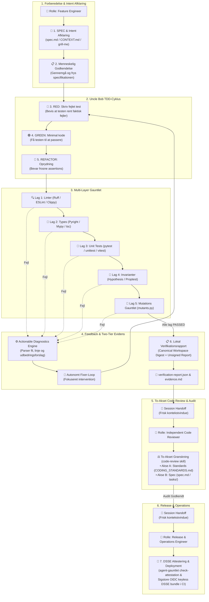

<p align="center">
  <a href="#-arkitektur--designprincipper"><b>Arkitektur</b></a> •
  <a href="#-hvordan-virker-agent-gauntlet-livscyklus--fsm"><b>Livscyklus & AI-Roller</b></a> •
  <a href="#️-mappestruktur-package-by-feature"><b>Mappestruktur</b></a> •
  <a href="#-hurtig-start--anvendelse"><b>Hurtig Start (NPX)</b></a> •
  <a href="#️-fuld-cli-reference"><b>CLI Reference</b></a> •
  <a href="#-python-api"><b>Python API</b></a> •
  <a href="#️-arkitektur-adrs"><b>ADRs</b></a> •
  <a href="CHANGELOG.md"><b>Changelog</b></a>
</p>

---

<p align="center">
  <br/>
  <em>»Spiessgasse« (Pike-Alley / <a href="https://en.wikipedia.org/wiki/Running_the_gauntlet">Running the Gauntlet</a>) — <a href="https://en.wikipedia.org/wiki/Jost_Amman">Jost Amman</a> illustration, Kriegs Ordnung (1564)</em>
</p>

<h1 align="center">agent-gauntlet 🛡️</h1>

<p align="center">
  <em>Universel multi-stack verifikations- og actionable diagnostics motor bygget på Robert C. Martin ("Uncle Bob") TDD & Clean Craftsmanship</em>
</p>

<p align="center">
  <a href="https://github.com/rolfmadsen/agent-gauntlet/actions/workflows/ci.yml"></a>
  <a href="tools/mutants.py"></a>
  <a href="docs/adr/0005-two-tier-verification-and-attestation-model.md"></a>
  <a href="pyproject.toml"></a>
  <a href="LICENSE"></a>
</p>

---

**Dokumentation**: [Makro-Spec](spec.md) • [Domæne-Glossary](CONTEXT.md) • [Kodestandarder](CODING_STANDARDS.md) • [Arkitektur (ADRs)](docs/adr/) • [Changelog](CHANGELOG.md)

**Kildekode & Pakker**: [GitHub](https://github.com/rolfmadsen/agent-gauntlet) • [NPM Pakke](packages/agent-gauntlet)

---

**agent-gauntlet** omgiver AI-genereret kode med et kompromisløst verifikations-gauntlet (Linters, Type-checkere, Unit tests, Property- og Invariant-tests, Mutationsafprøvning og To-Tier evidens & attestering jf. [ADR 0005](docs/adr/0005-two-tier-verification-and-attestation-model.md)) og oversætter rå fejludskrifter til **Actionable Diagnostics** i et feedback-loop, som AI-agenter kan handle direkte på.

---

## 🎯 Arkitektur & Designprincipper

1. **Uncle Bob Clean Architecture & TDD:**
   * Forankret i de 3 Love for TDD, Transformation Priority Premise (TPP) og Single Responsibility Principle (SRP).
2. **Package-by-Feature Struktur (Screaming Architecture):**
   * Hver komponent er isoleret i en feature-underpakke med høj sammenhørighed og lav kobling ([ADR 0001](docs/adr/0001-package-by-feature-architecture.md)).
3. **Multi-Stack Support (Tier-1):**
   * 🐍 **Python**: `ruff`, `pyright`/`mypy`, `pytest`/`unittest`, `hypothesis`, `mutants.py`/`mutmut`.
   * 🌐 **TypeScript / Node**: `eslint`/`biome`, `tsc --noEmit`, `vitest`/`jest`, `fast-check`, `stryker`.
   * 🦀 **Rust**: `cargo clippy`, `cargo check`, `cargo test`, `proptest`, `cargo-mutants`.
4. **Actionable Diagnostics Engine:**
   * Omsætter rå fejludskrifter til strukturerede diagnoser med filstier, linjenumre og præcise udbedringsforslag (`remediation_hint`).
5. **Two-Tier Evidens & Tillidsmodel ([ADR 0005](docs/adr/0005-two-tier-verification-and-attestation-model.md)):**
   * Deterministisk `CanonicalWorkspaceManifest` med symlink-flugtbeskyttelse og usignerede `verification-report.json` rapporter til lokal drift-kontrol kombineret med uafhængig, kryptografisk Sigstore OIDC attestering i CI.

---

## 🧭 Hvordan virker agent-gauntlet? (Livscyklus & FSM)

`agent-gauntlet` styrer AI-agenter igennem en deterministisk, videnskabelig udviklingsproces, hvor påstande erstattes af eksekverbare beviser, og hvor specialiserede ingeniør-personaer overdrager arbejdet uden *context rot* eller *review fatigue*:



### 👥 De 3 AI roller & Livscyklus-FSM:

For at undgå uendelige review-loops (*bikeshedding*) og bevare et skarpt kontekstvindue, anvender `agent-gauntlet` en deterministisk **Finite State Machine** (`infer_next_session_role()`):

1. **`Senior Software Engineer (Feature Implementation & Testing)`**:
   * Etablerer SPEC, forankrer domænebegreber i `CONTEXT.md` og driver TDD-cyklussen (`RED` $\to$ `GREEN` $\to$ `REFACTOR`).
   * Forsegler den lokale evidens via `agent-gauntlet verify --task-id <id> --save`.
2. **`Senior Software Engineer (Independent Code Review & Audit)`**:
   * Starter i en ren, frisk session for at undgå bias og context rot.
   * Udfører to-akset granskning langs **Akse A (Kodestandarder)** jf. `CODING_STANDARDS.md` og **Akse B (Krav & Invarianter)** jf. `spec.md` og `tasks/`.
3. **`Release & Operations Engineer (Release Attestation & Deployment)`**:
   * Tager over når alle opgaver og audits er godkendt.
   * Validerer release-eligibility via `agent-gauntlet check-attestation`, opdaterer changelog, bumper version og klargør næste epokes opgaver i `tasks/`.

---

## 🏗️ Mappestruktur (`Package-by-Feature`)

```text
agent-gauntlet/
├── tasks/                        # Aktive og afsluttede opgavepakker (OKF v0.2)
├── docs/adr/                     # Arkitekturbeslutninger (ADRs)
├── CONTEXT.md                    # Domæne-glossary (Aristoteles' genus et differentiam)
├── CODING_STANDARDS.md           # Multi-stack kodestandarder (Python, TS, Rust, Go, Web)
├── spec.md                       # Makro-specifikation & system-invarianter
├── CHANGELOG.md                  # Versionshistorik & release notes (Keep a Changelog)
├── ROADMAP.md                    # Prioriteret feature-køreplan & udvidelser
├── gauntlet.toml                 # Deklarativ multi-stack konfiguration
├── packages/agent-gauntlet/      # NPM / NPX distributions-pakke & bin/agent-gauntlet.js wrapper
├── plugins/agent-gauntlet/       # Antigravity plugin & skills (old-coder, grill-me, code-review, diagnose)
├── src/agent_gauntlet/
│   ├── __init__.py
│   ├── cli.py                    # Udvidet CLI (init, verify, check-evidence, check-attestation, okf)
│   └── features/
│       ├── adapters/             # Vertikale feature-slices for AI-harnesses (Antigravity, Claude mv.)
│       ├── config/               # gauntlet.toml / gauntlet.json loader & schema
│       ├── diagnostics/          # Actionable LLM feedback engine & extractors
│       ├── evidence/             # Canonical manifest, verification report, attestation & trust policy
│       ├── gauntlet/             # Multi-layer runner & timeout kontrol
│       ├── hooks/                # Pre-invocation policy engine gatekeeper
│       ├── okf/                  # OKF v0.2 metadata parsing, validering & stempling
│       ├── scaffold/             # Ikke-destruktiv bootstrap motor
│       └── stacks/               # Auto-detektor & standardprofiler (Python, TS, Rust)
└── tests/features/               # 1:1 testsymmetri mod features
```

---

## 🚀 Hurtig Start & Anvendelse

### 1. Initialiser dit Projekt (Zero Setup via NPX)
Stil dig i dit projektkatalog (f.eks. et TypeScript, Python, Rust eller Go projekt), og kør:

Åben dit projekt
```bash
cd ~/sti/til/dit-projekt
```

Scaffold for alle in-repo styringsfiler direkte uden forudgående installation:
```bash
npx @agent-gauntlet/cli init
```

#### 📦 Hvad `agent-gauntlet init` opretter lokalt i projektet (In-Repo Single Source of Truth):
| Fil / Mappe | Formål |
|---|---|
| [`gauntlet.toml`](gauntlet.toml) | Deklarativ konfiguration af linter, types, tests, mutation testing |
| [`CONTEXT.md`](CONTEXT.md) | Domæne-glossary for projektet (Aristoteles' *definitio per genus et differentiam*) |
| [`CODING_STANDARDS.md`](CODING_STANDARDS.md) | Multi-stack kodestandarder (Python, TypeScript, Rust, Go, CSS/Web) |
| [`spec.md`](spec.md) | Makro-specifikation og system-invarianter |
| [`tasks/001-bootstrap.md`](tasks/) | Opgavemappe til håndhævelse af task-kontrakter & acceptkriterier |
| [`docs/adr/`](docs/adr/) | Architecture Decision Records (ADR) til projekt-specifikke beslutninger |
| [`.agents/AGENTS.md`](.agents/AGENTS.md) | AI-agent retningslinjer, Response HUD og task-management protokoller |
| [`.agents/hooks.json`](.agents/hooks.json) | Pre-Invocation Hook til Stop/Go gatekeeperen |
| [`.agents/skills/`](.agents/skills/) | Bundled skills (`old-coder`, `grill-me`, `grill-with-docs`, `diagnose`, `code-review`) |

> [!TIP]
> **🛡️ Ikke-destruktiv garanti (Safety First):**  
> `agent-gauntlet init` overskriver **aldrig** eksisterende filer i dit projekt, medmindre du udtrykkeligt angiver `--force`.

> [!IMPORTANT]
> **🚪 Zero Lock-in & Ren Afinstallation (Clean Uninstall):**  
> Da alt ligger lokalt i projektets Git-træ, slettes `agent-gauntlet` fra et projekt med én simpel kommando uden at efterlade globale ændringer på maskinen:
> ```bash
> rm -rf .agents tasks docs/adr CONTEXT.md CODING_STANDARDS.md spec.md gauntlet.toml evidence.json evidence.md
> ```

---

### 2. Kør Verifikation & Tjek Evidens
Når du arbejder på en opgave i dit projekt, afvikles gauntlettet direkte via:

```bash
# Kør gauntlet og forseg evidens for en opgave:
npx @agent-gauntlet/cli verify --task-id 001-bootstrap

# Valider dokumentation & OKF v0.2 metadata:
npx @agent-gauntlet/cli okf validate
```

---

## 🛠️ Fuld CLI Reference

### 1. Initialiser Workspace (`init`)
Klargør lynhurtigt et nyt eller eksisterende projekt med fuld scaffolding:

```bash
# Standard auto-detektering af stack
agent-gauntlet init

# Eksplicit valg af stack og konfigurationsformat
agent-gauntlet init --stack typescript
agent-gauntlet init --stack rust --format json

# Tving overskrivning af eksisterende skabeloner
agent-gauntlet init --force
```

### 2. Kør Verifikations-Gauntlet (`verify`)
Kør alle konfigurerede lag, udtræk actionable diagnostics og generer en usigneret verifikationsrapport (`verification-report.json` v2.0 og `evidence.md`):

```bash
# Standard kørsel bundet til en opgave
agent-gauntlet verify --task-id 001-bootstrap

# Returner struktureret JSON med actionable diagnostics til LLM / AI-agenter
agent-gauntlet verify --diagnostics-json

# Kør mod en specifik testfil / mål (markerer kørslen PARTIAL for at forhindre for tidlig stabilisering)
agent-gauntlet verify --test-target tests.features.test_gauntlet
```

Når gauntlettet passerer, beregner `agent-gauntlet` automatisk et deterministisk `CanonicalWorkspaceManifest` (pre og post testkørsel), genererer `verification-report.json` og opdaterer `evidence.md`.

### 3. Validering af Evidens & Drift-kontrol (`check-evidence`)
Verificerer at det aktuelle kildetræ matcher den lokale verifikationsrapport, og at alle påkrævede tjek bestod:

```bash
agent-gauntlet check-evidence
```

**Output eksempler:**
* **Gyldig kildetilstand:**
  ```text
  [VALID] Source manifest verified (46970990edf43304) [origin: LOCAL, attestation: ABSENT].
  ```
* **Kildekode ændret efter verifikation (Drift):**
  ```text
  FAILED: Source manifest drift detected! Report bound to '46970990edf43304', but current workspace is '7c12f00a...'.
  ```

### 4. Attesteringsvalidering & Release Gate (`check-attestation`)
Validerer uafhængige, detached Sigstore / GitHub OIDC attestationsbundter mod en defineret tillidspolitik ([ADR 0005](docs/adr/0005-two-tier-verification-and-attestation-model.md)):

```bash
# Valider rapport og attestering
agent-gauntlet check-attestation --attestation attestation.bundle --trust-policy .agent-gauntlet/trust-policy.json

# Advisory-mode for lokale uattesterede kendsgerninger
agent-gauntlet check-attestation --allow-unattested
```

### 5. OKF Metadata Validering (`okf validate`)
Validerer Open Knowledge Format (OKF v0.2) overensstemmelse for Markdown-dokumenter:

```bash
agent-gauntlet okf validate
# Validerer frontmatter-skemaer, aktører og temporale invarianter (t_verified >= t_generated)
```

---

## 💻 Python API

Du kan også integrere `agent-gauntlet` direkte i dine egne Python test-runners eller agent-workflows:

```python
from agent_gauntlet.features.gauntlet import run_gauntlet
from agent_gauntlet.features.config import load_config
from agent_gauntlet.features.evidence import (
    CanonicalWorkspaceManifest,
    VerificationReportEngine,
    TrustPolicy,
    evaluate_trust_policy,
)

# 1. Indlæs konfiguration og kør gauntlet
config = load_config(".")
layers = config.to_layer_definitions()
report = run_gauntlet(layers)

# 2. Beregn deterministisk kildemanifest
manifest = CanonicalWorkspaceManifest.compute(".")

# 3. Opret usigneret verifikationsrapport
engine = VerificationReportEngine()
verification_report = engine.create_report(
    task_id="task-001",
    task_title="Bootstrap",
    verdict="PASSED" if report.success else "FAILED",
    manifest_pre=manifest,
    manifest_post=manifest,
    layers=report.layers,
)

# 4. Evaluer tillidspolitik
policy = TrustPolicy.strict()
decision = evaluate_trust_policy(verification_report, attestation=None, policy=policy)
print(f"Release eligible: {decision.release_eligible}")
```

---

## 🧪 Verifikation & Gauntlet Test

Kør hele verifikationskæden med 100% mutationsdrab og negative controls:

```bash
sh tools/gauntlet.sh
```

---

## 🗺️ Arkitektur (ADRs)

- 🏛️ **[docs/adr/](docs/adr/)**: Arkitekturbeslutninger (Architecture Decision Records) der fastlægger projektets invariante tekniske valg og designprincipper.

## 🗺️ Roadmap

- 🗺️ **[ROADMAP.md](ROADMAP.md)**: Prioriteret oversigt over fremtidige features (Multi-Harness integration, Changed-Line Differential Coverage, Fresh-Context Adversarial Verifier m.fl.).

---

## 🙏 Anerkendelse & Inspiration (Credits)

`agent-gauntlet` bygger videre på idéer, historiske rødder og pionerarbejde inden for stringent verifikation:

- **[Jost Amman (1564)](https://en.wikipedia.org/wiki/Jost_Amman)**: For den historiske illustration af *Spiessgasse* (*[Running the Gauntlet](https://en.wikipedia.org/wiki/Running_the_gauntlet)*, *Kriegs Ordnung*), der symboliserer at lade koden løbe igennem en uomgængelig række af spyd (linters, typer, tests, invarianter og mutationer).
- **[Robert C. Martin ("Uncle Bob")](https://x.com/unclebobmartin/status/2080257779395154409)**: For den oprindelige idé om at erstatte manuel kodeinspektion med en uomgængelig *gauntlet* af tests, typer, mutation testing og invarianter.
- **[amazingang (old-coder)](https://github.com/amazingang/old-coder)**: For formuleringen af Evidence-First filosofien (*"Trust moves from inspection to constraints"*).
- **[Matt Pocock](https://github.com/mattpocock)**: For skabelsen af workflow-skills (`grill-me`, `grill-with-docs`, `diagnose`, `code-review` m.fl.), som muliggør sokratisk kravsafklaring, domæneforankring og uafhængig to-akset kode-granskning.


